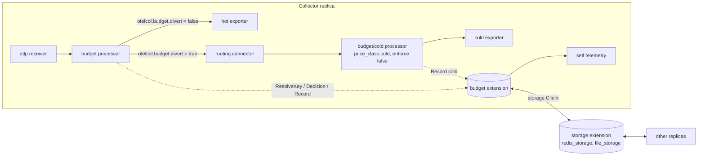

# Design

Per key telemetry spend budgets enforced inside the OpenTelemetry Collector, across logs, traces, and metrics, with SLO style burn rates. When a key burns its budget too fast, enforcement escalates by tier: drop low severity logs, sample traces consistently, drop non critical metrics, divert to cheap cold storage. Errors are never dropped (a divert tier diverts them with the rest of the key's data), and exempt keys are never enforced.

## Architecture

In the real pipeline the processor exports to the routing connector, which sends resources stamped `otelcol.budget.divert = true` to the cold pipeline and everything else to the hot one (see `examples/05-divert-cold.yaml`).

### Why the extension holds the state

Processors are created per pipeline. A processor only design would give one ledger, and one decision loop per pipeline, and the tier of a key could differ between its logs and its traces. A shared processor (the old `memory_limiter` pattern) only shares state for one component ID, so `budget` and `budget/cold` could not share a ledger without a package global. The extension owns keying, pricing, ledgers, sync, decisions, and telemetry. The processor finds it through `host.GetExtensions()` and talks to it through `budgetapi.Ledger`.

### Packages

| Package | Role |
|---|---|
| `extension/budgetextension` | Config, factory, lifecycle, decision loop, telemetry. |
| `extension/budgetextension/budgetapi` | The contract with the processor: `Ledger`, `Decision`, `Action`, `Usage`, series hashing. |
| `extension/budgetextension/internal/keying` | Key extraction, overflow to `__other__`, rule matching, lock free key cache. |
| `.../internal/costmodel` | Integer micro unit pricing with exact remainders. Pure functions. |
| `.../internal/ledger` | Atomic counters with remainder carry, period math, fixed size ring buffers. |
| `.../internal/decision` | Burn rates, tiers, warm up, hard cap, hysteresis, staleness, exemptions, most restrictive merge. |
| `.../internal/sync` | `local`, `share`, `storage` (increment or G-Counter). |
| `.../internal/seriescount` | Lock free HyperLogLog for active series per hour. |
| `.../internal/clock` | Injectable clock; tests use a fake one. |
| `processor/budgetprocessor` | Measures, applies actions, stamps, reports usage. |

## Hot path

Per batch, for each resource:

1. `key := ledger.ResolveKey(resource)`: hash of the relevant attributes, one atomic load from a 4096 slot cache, values verified. 36 ns on a hit.
2. `d := ledger.Decision(key)`: one atomic pointer load and a map lookup. 2 ns.
3. Offered usage accumulates (proto size, item count).
4. If enforcing and not exempt, actions run, skipping always pass records.
5. The resource gets `otelcol.budget.key`, `otelcol.budget.tier`, and `otelcol.budget.divert` when diverting.
6. Accepted usage accumulates unless the resource is diverted.
7. After the batch: one `Record` and one `RecordOffered` per key.

`Record` prices the usage and adds it with atomics to the key and to each group it belongs to, and forwards whole micro units to the sync layer. No mutex is taken; the only lock is inside `sync.Map` the first time a new key or ledger ID is stored.

## Formulas

- **Cost units.** `1 unit = 1e-6` of the currency, as `int64`. Config values are converted once with rounding to the nearest micro unit.
- **Logs and traces.** `cost = bytes * compression_ratio * price_per_GB / 1e9` (or `spans * price / 1e6` with `traces_million_spans`).
- **Metrics.** `cost = points * price / 1e6`, plus at each hour boundary `estimate(active series) * series_hour`.
- **Burn rate** over window `w`: `burn_w = spend_in_last_w / (budget * w / period)`, computed from ring buffer differences of a monotonic fleet total, scaled by the window coverage actually available. `1.0` is exactly the sustainable pace. Each window keeps 32 samples at least `w/32` apart (16 bytes each), so memory per key is the same for any window and decision interval; the delta ends at the latest synced total and starts at most `w/32` before the window start.
- **Escalation.** Highest tier `i` with `burn_short >= threshold_i` and `burn_long >= threshold_i`, once the samples cover `warmup_coverage` of the short window.
- **Hard cap.** When period spend `>= budget`: at least the highest non divert tier (`highest`) or the divert tier (`divert`).
- **De-escalation.** From tier `i` to `i-1` after `max(burn_long, offered_burn_long) < threshold_i * hysteresis.ratio` continuously for `min_dwell`. Offered burn is what the key would spend without enforcement (offered usage priced at hot prices, synced under `offered:<id>`), so a key whose data is being dropped does not de-escalate while it is still noisy, and does once its traffic falls.
- **Share mode.** Each replica compares against `budget / N`.
- **Consistent sampling.** Keep when `BigEndian.Uint64(traceID[8:16]) & (2^56 - 1) < ratio * 2^56`. The same trace ID gets the same answer on every replica and for every signal.
- **Most restrictive** of a key and its groups: the highest tier wins (all ledgers share one tier list, so equal tiers have identical actions). Any exemption exempts.

## Staleness and fail open

| Sync age | Effect |
|---|---|
| `< stale_after` | Normal. |
| `>= stale_after` | `Stale = true`: no escalation, de-escalation allowed. |
| `> fail_open_after` | Tier 0 for everything, `Healthy() = false`. |

A missing extension, or an unhealthy one when the processor has `fail_open: true`, also means tier 0.

After a sync gap longer than `stale_after`, or when fleet totals go backwards (storage lost its data), replicas catch up one by one as their clients reconnect: they flush the spend they held, or restore their lost contribution. For `stale_after` plus one `flush_interval` and one `read_interval` the windows restart at every sample, so the catch-up is not read as spend; warm up then applies as at start. Tiers hold while windows are cold: no escalation, and no de-escalation on a burn rate that covers nothing.

## Sync modes

- **local.** In memory counters are the fleet view. Optional checkpoints to a storage extension, restored on start. For single instances or when the load balancer shards by key.
- **share.** Local counters, budgets divided by N. A statistical approximation that assumes even load.
- **storage, increment.** Every `flush_interval` the pending deltas go out in one `BatchIncrementBy` call on keys `{period}/{escaped ledger}/{signal}/{class}`; the returned totals refresh the fleet view. Keys not refreshed by a flush are read every `read_interval`.
- **storage, G-Counter.** Each node owns `{period}/node/{node_id}` (JSON, zstd) with its own cumulative counters, written every `flush_interval`; every `read_interval` a node reads all other node blobs and sums them. Blobs of removed nodes keep counting, which is correct.

In storage mode replicas also share their tiers: each writes its own with a timestamp on every flush and reads the others' on every read, and the published tier of a key is the highest tier any replica decided in the last `stale_after`. Replicas reading fleet totals a few seconds apart therefore cannot settle on different tiers near a threshold.

`auto` picks increment when the storage client implements `BatchIncrementBy`, else G-Counter, and logs the choice once.

## Known limitations

- Series hours are additive across replicas only with consistent series routing (the same series always lands on the same replica).
- Proto size approximates, but does not equal, backend billing (compression, indexing, retention are not modelled).
- `share` mode assumes even load across replicas.
- Keys built from client controlled attributes such as `service.name` can be spoofed. Group rules on Kubernetes labels (from `k8sattributes`) mitigate it.
- Metric label stripping is out of scope.
- ERROR spans always pass, so a sampled out trace can keep its error spans.
